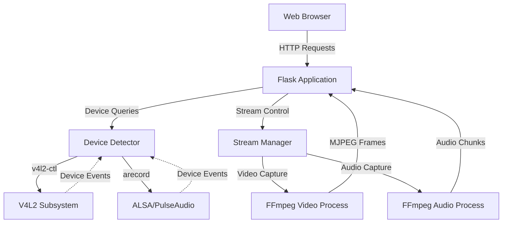

# Design Document: Webcam Audio Auto-Detection

## Overview

This design enhances the existing Flask-based webcam streaming application to support automatic device detection, optional audio streaming, and dynamic configuration. The current implementation is hardcoded to `/dev/video0` with fixed YUYV format at 640x480@30fps. This redesign introduces a modular architecture that discovers available webcams and microphones, allows users to select devices and configurations through a web interface, and provides robust error handling with automatic recovery.

The system will use Python's native capabilities for device enumeration on Linux (V4L2 for video, ALSA/PulseAudio for audio), maintain FFmpeg for media capture and encoding, and extend the Flask application with RESTful endpoints for device management and stream control.

### Key Design Decisions

1. **Device Detection Strategy**: Use `v4l2-ctl` for webcam enumeration and `arecord -l` for microphone detection rather than implementing low-level V4L2/ALSA bindings. This provides reliable cross-platform Linux support with minimal dependencies.

2. **Architecture Pattern**: Separate concerns into distinct modules (device detection, stream management, web interface) to enable independent testing and future extensibility.

3. **Audio Integration**: Implement audio as an optional parallel stream rather than muxing with video, allowing independent failure handling and simpler client-side implementation.

4. **State Management**: Maintain stream state in-memory with explicit lifecycle management (stopped, starting, running, error, recovering) to support automatic recovery and clear user feedback.

## Architecture

### System Components



### Component Responsibilities

**Device Detector**
- Enumerate available webcams via V4L2 interface
- Enumerate available microphones via ALSA/PulseAudio
- Query supported formats, resolutions, and frame rates for each device
- Provide device metadata (name, path, capabilities)
- Cache device information with periodic refresh capability

**Stream Manager**
- Manage FFmpeg process lifecycle for video and audio streams
- Apply user-selected stream configurations
- Monitor process health and implement recovery logic
- Handle graceful shutdown and cleanup
- Maintain stream state and statistics

**Flask Application (Web Interface)**
- Serve static HTML/CSS/JavaScript for the user interface
- Provide REST API endpoints for device enumeration
- Provide REST API endpoints for stream control
- Stream MJPEG video frames via multipart HTTP response
- Stream audio data via separate HTTP endpoint
- Handle WebSocket connections for real-time status updates (optional enhancement)

### Data Flow

1. **Initialization**: Device Detector scans system on startup, caches available devices
2. **Device Selection**: User selects webcam/microphone via web UI, sends configuration to Flask API
3. **Stream Start**: Stream Manager spawns FFmpeg processes with selected configuration
4. **Streaming**: FFmpeg outputs are piped to Flask routes, served to browser
5. **Monitoring**: Stream Manager polls FFmpeg process health, triggers recovery on failure
6. **Shutdown**: User stops stream, Stream Manager terminates FFmpeg processes cleanly

## Components and Interfaces

### Device Detector Module

**Class: DeviceDetector**

```python
class DeviceInfo:
    device_path: str          # e.g., "/dev/video0"
    device_name: str          # e.g., "HD Pro Webcam C920"
    device_type: str          # "video" or "audio"
    capabilities: dict        # Format-specific capabilities

class VideoCapabilities:
    formats: List[str]        # e.g., ["yuyv422", "mjpeg"]
    resolutions: List[Tuple[int, int]]  # e.g., [(640, 480), (1280, 720)]
    frame_rates: List[int]    # e.g., [15, 30, 60]

class AudioCapabilities:
    formats: List[str]        # e.g., ["S16_LE", "S32_LE"]
    sample_rates: List[int]   # e.g., [44100, 48000]
    channels: List[int]       # e.g., [1, 2]

class DeviceDetector:
    def detect_video_devices() -> List[DeviceInfo]:
        """Enumerate all V4L2 video devices"""

    def detect_audio_devices() -> List[DeviceInfo]:
        """Enumerate all ALSA/PulseAudio input devices"""

    def get_video_capabilities(device_path: str) -> VideoCapabilities:
        """Query supported formats for a video device"""

    def get_audio_capabilities(device_path: str) -> AudioCapabilities:
        """Query supported formats for an audio device"""

    def refresh_devices() -> None:
        """Re-scan system for device changes"""
```

**Implementation Notes**:
- Use `subprocess` to invoke `v4l2-ctl --list-devices` and parse output
- Use `subprocess` to invoke `arecord -l` for audio device enumeration
- Parse `v4l2-ctl --device=/dev/videoX --list-formats-ext` for capabilities
- Cache results with 30-second TTL to avoid excessive system calls
- Handle parsing errors gracefully, log warnings for unparseable devices

### Stream Manager Module

**Class: StreamManager**

```python
class StreamConfig:
    video_device: str
    video_format: str
    resolution: Tuple[int, int]
    frame_rate: int
    audio_enabled: bool
    audio_device: Optional[str]
    audio_format: Optional[str]
    audio_sample_rate: Optional[int]

class StreamState(Enum):
    STOPPED = "stopped"
    STARTING = "starting"
    RUNNING = "running"
    ERROR = "error"
    RECOVERING = "recovering"

class StreamManager:
    def __init__(self):
        self.video_process: Optional[subprocess.Popen] = None
        self.audio_process: Optional[subprocess.Popen] = None
        self.state: StreamState = StreamState.STOPPED
        self.config: Optional[StreamConfig] = None
        self.restart_attempts: int = 0
        self.max_restart_attempts: int = 3

    def start_stream(config: StreamConfig) -> bool:
        """Start video and optional audio streams"""

    def stop_stream() -> None:
        """Stop all active streams"""

    def get_state() -> StreamState:
        """Get current stream state"""

    def get_video_frame() -> bytes:
        """Read next MJPEG frame from video process"""

    def get_audio_chunk() -> bytes:
        """Read next audio chunk from audio process"""

    def monitor_health() -> None:
        """Check process health, trigger recovery if needed"""

    def _attempt_recovery() -> bool:
        """Attempt to restart failed stream"""
```

**Implementation Notes**:
- Build FFmpeg command dynamically based on StreamConfig
- Use `subprocess.Popen` with `stdout=PIPE` for frame/chunk reading
- Implement frame boundary detection for MJPEG (0xFFD8 start, 0xFFD9 end)
- Monitor process return codes and stderr for error detection
- Implement exponential backoff for recovery attempts (2s, 4s, 8s)
- Use threading locks to prevent concurrent stream modifications

### Flask Application Module

**REST API Endpoints**

```
GET  /api/devices/video
     Response: List[DeviceInfo] with video capabilities

GET  /api/devices/audio
     Response: List[DeviceInfo] with audio capabilities

POST /api/stream/start
     Body: StreamConfig
     Response: {success: bool, message: str}

POST /api/stream/stop
     Response: {success: bool, message: str}

GET  /api/stream/status
     Response: {state: str, config: StreamConfig, stats: dict}

POST /api/devices/refresh
     Response: {success: bool, device_count: int}

GET  /video_feed
     Response: multipart/x-mixed-replace MJPEG stream

GET  /audio_feed
     Response: audio/mpeg or audio/wav stream
```

**Web Interface (HTML/JavaScript)**

- Single-page application with device selection dropdowns
- Configuration panel for resolution/framerate selection
- Audio enable/disable toggle
- Start/Stop stream buttons
- Real-time status display (resolution, FPS, audio state)
- Error message display area
- Device refresh button
- Responsive layout using CSS Grid/Flexbox

## Data Models

### Device Information

```python
@dataclass
class DeviceInfo:
    device_path: str
    device_name: str
    device_type: Literal["video", "audio"]
    capabilities: Union[VideoCapabilities, AudioCapabilities]

    def to_dict(self) -> dict:
        """Serialize for JSON API response"""

@dataclass
class VideoCapabilities:
    formats: List[str]
    resolutions: List[Tuple[int, int]]
    frame_rates: List[int]

    def get_default_config(self) -> dict:
        """Return sensible default configuration"""

@dataclass
class AudioCapabilities:
    formats: List[str]
    sample_rates: List[int]
    channels: List[int]

    def get_default_config(self) -> dict:
        """Return sensible default configuration"""
```

### Stream Configuration

```python
@dataclass
class StreamConfig:
    video_device: str
    video_format: str = "yuyv422"
    resolution: Tuple[int, int] = (640, 480)
    frame_rate: int = 30
    audio_enabled: bool = False
    audio_device: Optional[str] = None
    audio_format: Optional[str] = "s16le"
    audio_sample_rate: Optional[int] = 44100
    audio_channels: int = 1

    def validate(self) -> Tuple[bool, Optional[str]]:
        """Validate configuration parameters"""

    def to_ffmpeg_video_args(self) -> List[str]:
        """Generate FFmpeg arguments for video capture"""

    def to_ffmpeg_audio_args(self) -> List[str]:
        """Generate FFmpeg arguments for audio capture"""
```

### Stream State

```python
@dataclass
class StreamStatus:
    state: StreamState
    config: Optional[StreamConfig]
    uptime_seconds: float
    frames_captured: int
    current_fps: float
    audio_active: bool
    error_message: Optional[str]
    restart_attempts: int

    def to_dict(self) -> dict:
        """Serialize for JSON API response"""
```


## Correctness Properties

*A property is a characteristic or behavior that should hold true across all valid executions of a system—essentially, a formal statement about what the system should do. Properties serve as the bridge between human-readable specifications and machine-verifiable correctness guarantees.*

### Property 1: Device Detection Completeness

*For any* detected device (video or audio), the device information must include a non-empty system path, a non-empty human-readable name, and queryable capabilities (formats, resolutions/sample rates, and frame rates/channels).

**Validates: Requirements 1.2, 1.4, 2.2, 2.4**

### Property 2: Device API Exposure

*For any* set of devices detected by the Device Detector, the API endpoints `/api/devices/video` and `/api/devices/audio` shall return all detected devices without omission or duplication.

**Validates: Requirements 1.5, 4.1, 4.2**

### Property 3: Audio State Consistency

*For any* stream configuration, the presence of an active audio capture process shall match the `audio_enabled` flag in the configuration (audio process exists if and only if audio_enabled is true).

**Validates: Requirements 3.1, 3.3**

### Property 4: Audio Streaming Completeness

*For any* stream configuration where audio is enabled with a valid microphone device, both the audio capture process and the `/audio_feed` HTTP endpoint shall be active and serving data.

**Validates: Requirements 3.2, 3.4**

### Property 5: Configuration Application Fidelity

*For any* valid stream configuration, the generated FFmpeg command arguments shall include the exact device paths, format specifications, resolution, and frame rate specified in the configuration.

**Validates: Requirements 4.3, 4.4, 5.2**

### Property 6: Status API Completeness

*For any* stream state (stopped, starting, running, error, recovering), the `/api/stream/status` endpoint shall return a complete status object including state, configuration (if applicable), uptime, frame statistics, audio state, and error messages (if applicable).

**Validates: Requirements 4.6, 8.1, 8.5**

### Property 7: Capability Query Availability

*For any* selected webcam device, querying its capabilities shall return at least one supported format, at least one supported resolution, and at least one supported frame rate.

**Validates: Requirements 5.1**

### Property 8: Configuration Validation

*For any* stream configuration, the `validate()` method shall return false if any of the following conditions hold: video_device is empty, resolution dimensions are non-positive, frame_rate is non-positive, or audio is enabled but audio_device is empty.

**Validates: Requirements 5.4**

### Property 9: Configuration Change Triggers Restart

*For any* two distinct valid stream configurations, changing from one to the other while streaming shall result in the stream state transitioning through STOPPED and back to RUNNING with the new configuration applied.

**Validates: Requirements 5.5**

### Property 10: Stream Recovery Mechanism

*For any* stream failure during the RUNNING state, the Stream Manager shall attempt to restart the stream exactly 3 times with a 2-second delay between each attempt, and if all attempts fail, transition to ERROR state.

**Validates: Requirements 7.1, 7.3, 7.4, 7.5**

### Property 11: Device Refresh Updates Cache

*For any* state of the device cache, calling the `/api/devices/refresh` endpoint shall trigger a re-scan of the system, and subsequent device queries shall reflect any devices added or removed since the last scan.

**Validates: Requirements 8.4**

### Property 12: Configuration Validation Round-Trip

*For any* valid stream configuration, serializing it to JSON (via API) and then deserializing it back shall produce an equivalent configuration with all fields preserved.

**Validates: Requirements 5.2, 5.4**

## Error Handling

### Error Categories

**Device Detection Errors**
- No devices found: Log warning, return empty list, allow application to continue
- Device enumeration failure: Log error with command output, return cached devices if available
- Capability query failure: Log warning, exclude device from available list

**Stream Initialization Errors**
- Invalid configuration: Return error response with specific validation failure message
- FFmpeg spawn failure: Log error with stderr output, transition to ERROR state
- Device access denied: Return error with permission guidance (check user groups, device permissions)

**Runtime Errors**
- FFmpeg process crash: Capture exit code and stderr, trigger recovery mechanism
- Device disconnection: Detect via process termination, attempt recovery for video, disable audio and continue for audio
- Frame read timeout: Log warning, continue attempting to read (may indicate temporary slowdown)

**Recovery Errors**
- Max retries exceeded: Transition to ERROR state, log failure summary, notify user via status API
- Recovery during shutdown: Cancel recovery, proceed with clean shutdown

### Error Response Format

All API error responses follow this structure:

```json
{
  "success": false,
  "error": {
    "code": "ERROR_CODE",
    "message": "User-friendly error message",
    "details": "Technical details for debugging",
    "suggestion": "Actionable guidance for resolution"
  }
}
```

### Error Logging Strategy

- Use Python `logging` module with structured logging
- Log levels: DEBUG (frame counts, state transitions), INFO (device detection, stream start/stop), WARNING (recoverable errors), ERROR (unrecoverable failures)
- Include context in all log messages: device paths, configuration values, process IDs
- Capture FFmpeg stderr in separate log stream for debugging

## Testing Strategy

### Dual Testing Approach

This feature requires both unit tests and property-based tests to ensure comprehensive correctness:

- **Unit tests** verify specific examples, edge cases, and error conditions
- **Property-based tests** verify universal properties across all inputs using randomized test data
- Both approaches are complementary and necessary for production readiness

### Unit Testing Focus

Unit tests should focus on:

1. **Specific Examples**
   - Startup with no devices detected (Requirements 1.3, 2.3)
   - Audio failure during streaming (Requirement 3.5)
   - Invalid configuration fallback (Requirement 5.3)
   - Device disconnection scenarios (Requirements 6.1, 6.2)
   - FFmpeg process failure (Requirement 6.4)
   - Max retry exhaustion (Requirement 7.2)
   - API endpoint existence (Requirement 8.2)

2. **Integration Points**
   - Flask route registration and response formats
   - FFmpeg command generation from configuration
   - Device detection subprocess invocation and parsing
   - Stream Manager state transitions

3. **Edge Cases**
   - Empty device lists
   - Malformed v4l2-ctl output
   - FFmpeg immediate exit
   - Concurrent API requests during state transitions

### Property-Based Testing Configuration

**Library Selection**: Use `hypothesis` for Python property-based testing

**Test Configuration**:
- Minimum 100 iterations per property test (due to randomization)
- Use `@given` decorator with custom strategies for device info, configurations, and states
- Implement custom generators for valid device paths, resolutions, and format strings

**Property Test Implementation**:

Each correctness property from the design document must be implemented as a property-based test with the following tag format in a comment:

```python
# Feature: webcam-audio-auto-detection, Property 1: Device Detection Completeness
@given(device_type=st.sampled_from(['video', 'audio']))
def test_device_detection_completeness(device_type):
    """For any detected device, verify path, name, and capabilities are present"""
    # Test implementation
```

**Custom Strategies**:

```python
# Generate valid device configurations
stream_configs = st.builds(
    StreamConfig,
    video_device=st.sampled_from(['/dev/video0', '/dev/video1']),
    video_format=st.sampled_from(['yuyv422', 'mjpeg']),
    resolution=st.tuples(
        st.integers(min_value=320, max_value=1920),
        st.integers(min_value=240, max_value=1080)
    ),
    frame_rate=st.integers(min_value=15, max_value=60),
    audio_enabled=st.booleans(),
    audio_device=st.one_of(st.none(), st.sampled_from(['hw:0,0', 'hw:1,0']))
)

# Generate device info objects
device_infos = st.builds(
    DeviceInfo,
    device_path=st.text(min_size=1),
    device_name=st.text(min_size=1),
    device_type=st.sampled_from(['video', 'audio'])
)
```

**Property Test Coverage**:

- Property 1: Generate random device types, verify all fields present
- Property 2: Generate random device lists, verify API returns all
- Property 3: Generate random configs with audio enabled/disabled, verify process state matches
- Property 4: Generate random audio configs, verify both capture and endpoint active
- Property 5: Generate random valid configs, verify FFmpeg args match
- Property 6: Generate random stream states, verify status API completeness
- Property 7: Generate random device paths, verify capabilities non-empty
- Property 8: Generate random invalid configs, verify validation catches them
- Property 9: Generate pairs of different configs, verify restart behavior
- Property 10: Simulate random failures, verify retry count and timing
- Property 11: Generate random device changes, verify refresh updates cache
- Property 12: Generate random configs, verify JSON round-trip

### Test Environment Setup

**Dependencies**:
```
pytest>=7.0.0
pytest-cov>=4.0.0
hypothesis>=6.0.0
pytest-mock>=3.10.0
```

**Mocking Strategy**:
- Mock `subprocess.Popen` for FFmpeg process control
- Mock `subprocess.run` for device detection commands
- Use `pytest-mock` for Flask application testing
- Create fixture for temporary device state

**CI/CD Integration**:
- Run unit tests on every commit
- Run property tests with 100 iterations in CI
- Run extended property tests (1000 iterations) nightly
- Maintain >90% code coverage threshold

### Manual Testing Checklist

Some requirements require manual verification:

- [ ] UI displays loading indicator during device detection (8.3)
- [ ] Error messages are actionable and user-friendly (6.5)
- [ ] UI is responsive on mobile browsers (8.6)
- [ ] Video stream displays correctly in browser
- [ ] Audio stream synchronizes with video
- [ ] Device selection dropdowns populate correctly
- [ ] Stream recovery is transparent to user

