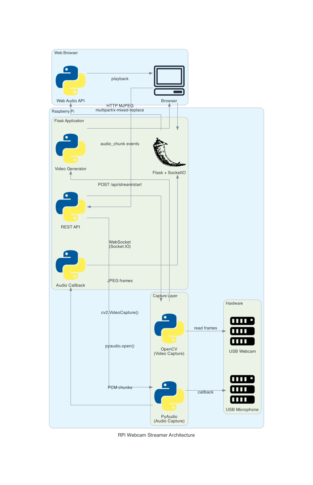

# Raspberry Pi Webcam Streamer

A Flask-based real-time webcam and audio streaming application optimized for Raspberry Pi with automatic device detection, low-latency audio, and efficient resource usage.



## Features

- **Real-time Video Streaming** - MJPEG over HTTP with OpenCV (100-200ms latency)
- **Real-time Audio Streaming** - WebSocket with Web Audio API (50-150ms latency)
- **Automatic Device Detection** - V4L2 video devices and ALSA audio devices
- **REST API** - Full control via HTTP endpoints
- **Responsive Web UI** - Single-page application with device selection
- **Optimized for RPi** - Low CPU usage (25-40%), efficient memory footprint
- **Configurable** - Resolution, framerate, audio quality, and more

## Quick Start

### Installation

```bash
# System dependencies (Debian/Ubuntu/Raspberry Pi OS)
sudo apt-get update
sudo apt-get install v4l-utils alsa-utils python3-opencv python3-pyaudio python3-gevent libffi-dev

# Python dependencies (minimal - uses system packages)
pip install -r requirements.txt
```

**Note for Raspberry Pi Zero:** Using system packages (`python3-gevent`, `python3-opencv`) avoids 20-30 minute compilation times.

### Running

```bash
python main.py
```

Access the web interface at `http://localhost:8080`

## Architecture

```
Browser ──HTTP──> Flask App ──OpenCV──> USB Webcam
   │                  │
   │                  └──PyAudio──> USB Microphone
   │                       │
   └──WebSocket (audio)────┘
   └──HTTP MJPEG (video)───┘
```

See [diagrams/architecture.md](diagrams/architecture.md) for detailed architecture diagram.

### Key Technologies

- **Video**: OpenCV for capture, JPEG encoding, HTTP multipart streaming
- **Audio**: PyAudio callback mode, WebSocket (Socket.IO), Web Audio API
- **Backend**: Flask + Flask-SocketIO with gevent
- **Frontend**: Vanilla JavaScript with Web Audio API

### Performance

- **CPU Usage**: 25-40% on Raspberry Pi 4
- **Memory**: ~65-105MB
- **Video Latency**: 100-200ms
- **Audio Latency**: 50-150ms (real-time)
- **Concurrent Tasks**: Leaves 60-75% CPU for other workloads

## Usage

### Web Interface

1. Open `http://localhost:8080` in your browser
2. Select video device and configure resolution/framerate
3. Optionally enable audio and select microphone
4. Click "Start Stream"
5. View real-time video and audio

### API Endpoints

```bash
# List devices
curl http://localhost:8080/api/devices

# Start stream
curl -X POST http://localhost:8080/api/stream/start \
  -H "Content-Type: application/json" \
  -d '{
    "video_device_index": 0,
    "resolution": [640, 480],
    "frame_rate": 15,
    "audio_enabled": true,
    "audio_device_index": 1
  }'

# Stop stream
curl -X POST http://localhost:8080/api/stream/stop

# Get status
curl http://localhost:8080/api/stream/status

# Video feed (MJPEG)
http://localhost:8080/video_feed

# Audio (WebSocket)
ws://localhost:8080/audio
```

See [docs/API_ENDPOINTS.md](docs/API_ENDPOINTS.md) for complete API documentation.

## Configuration

### Video Settings

```python
resolution: (640, 480)    # VGA, 720p, 1080p supported
frame_rate: 15            # 10-60 fps
jpeg_quality: 80          # 1-100 (lower = smaller files)
```

### Audio Settings

```python
audio_sample_rate: 16000  # 16kHz (phone quality, efficient)
audio_channels: 1         # Mono (stereo = 2)
audio_chunk_size: 512     # Smaller = lower latency, higher CPU
```

### Performance Tuning

**Lower Latency** (more CPU):
- `audio_chunk_size: 256`
- `frame_rate: 20`

**Lower CPU** (more latency):
- `audio_chunk_size: 1024`
- `frame_rate: 10`
- `resolution: (320, 240)`

**Best Quality** (most CPU):
- `audio_sample_rate: 22050`
- `audio_channels: 2`
- `frame_rate: 30`
- `jpeg_quality: 90`

## Project Structure

```
.
├── main.py                 # Flask app, API, streaming logic
├── device_detector.py      # V4L2/ALSA device detection
├── requirements.txt        # Python dependencies
├── static/
│   └── index.html         # Web UI with embedded audio client
├── tests/                 # Test suite
│   ├── test_main.py
│   ├── test_device_detector.py
│   └── test_api_manual.py
├── docs/                  # API documentation
│   ├── API_ENDPOINTS.md
│   ├── WEB_UI.md
│   └── DEVICE_DETECTOR.md
└── diagrams/              # Architecture diagrams
    └── architecture.md
```

## Testing

```bash
# Run all tests
pytest tests/ -v

# Run specific test
pytest tests/test_main.py -v

# Manual device detection test
python tests/test_manual_device_detection.py
```

## Troubleshooting

### Installation Errors

**"ffi.h: No such file or directory" or "Package libffi was not found"**
- Install libffi development headers: `sudo apt-get install libffi-dev`
- Then retry: `pip install -r requirements.txt`

### High CPU Usage
- Reduce frame rate: `frame_rate: 10`
- Lower resolution: `resolution: (320, 240)`
- Reduce JPEG quality: `jpeg_quality: 70`

### Audio Dropouts
- Increase chunk size: `audio_chunk_size: 1024`
- Check CPU usage (should be < 80%)
- Verify network stability

### No Audio
- Check PyAudio installation: `sudo apt-get install python3-pyaudio`
- Verify audio device: `arecord -l`
- Check browser console for errors
- Hard refresh browser (Ctrl+Shift+R)
- **If segfault occurs**: ALSA is misconfigured. Create `~/.asoundrc`:
  ```bash
  cat > ~/.asoundrc << 'EOF'
  pcm.!default {
      type hw
      card 2
      device 0
  }
  ctl.!default {
      type hw
      card 2
  }
  EOF
  ```
  Replace `card 2` with your USB audio card number from `arecord -l`, then restart the app.

### Video Lag
- Reduce resolution
- Lower frame rate
- Check network bandwidth

## Requirements

- Python 3.7+
- Raspberry Pi OS / Debian / Ubuntu
- USB webcam with V4L2 support
- USB microphone (optional)

## Documentation

- [API Reference](docs/API_ENDPOINTS.md) - Complete REST API documentation
- [Web UI Guide](docs/WEB_UI.md) - Web interface usage
- [Device Detection](docs/DEVICE_DETECTOR.md) - Device detection details
- [Architecture](diagrams/architecture.md) - System architecture diagram

## License

MIT

## Contributing

Contributions welcome! Please ensure tests pass before submitting PRs.

```bash
pytest tests/ -v
```
